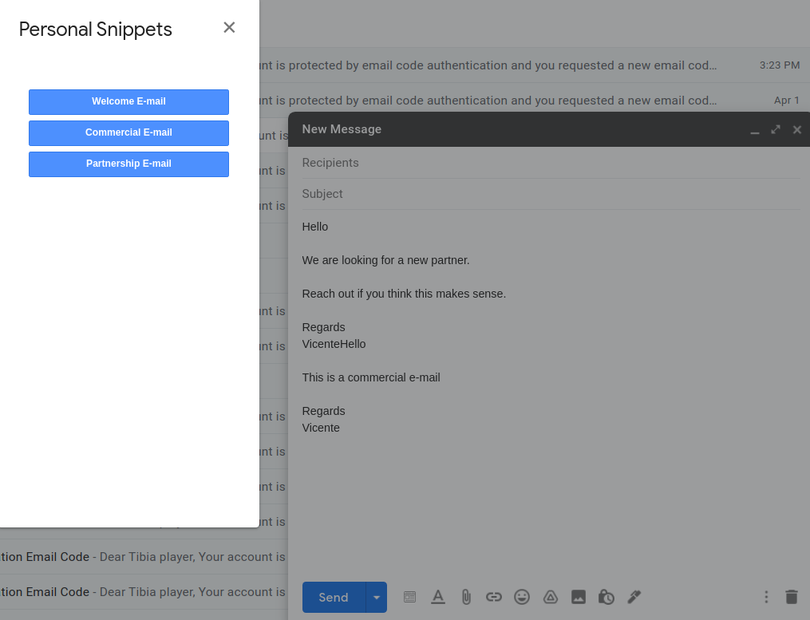
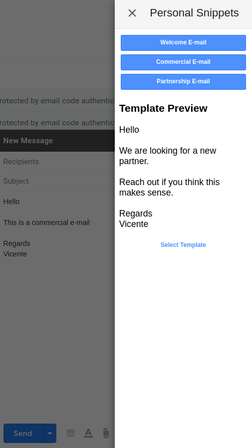
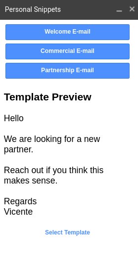
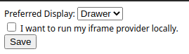

## Usage

This is an unpacked Google chrome plugin. In order to use it, head to ``chrome://extensions`` on your Google Chrome browser.

Once there, toggle `developer mode` at the top right side of your screen. Once development mode is toggled on, click on `Load Unpacked` and select the directory provided in this repository.

## User options

### Displays
Inside the plugin options you can choose between three different displays:

- Modal  

- Drawer  

- Mole  

### Running Locally
Set whether or not you are are running a local version of the react app. This means you don't have to edit the URL from where the iframe is being served.

